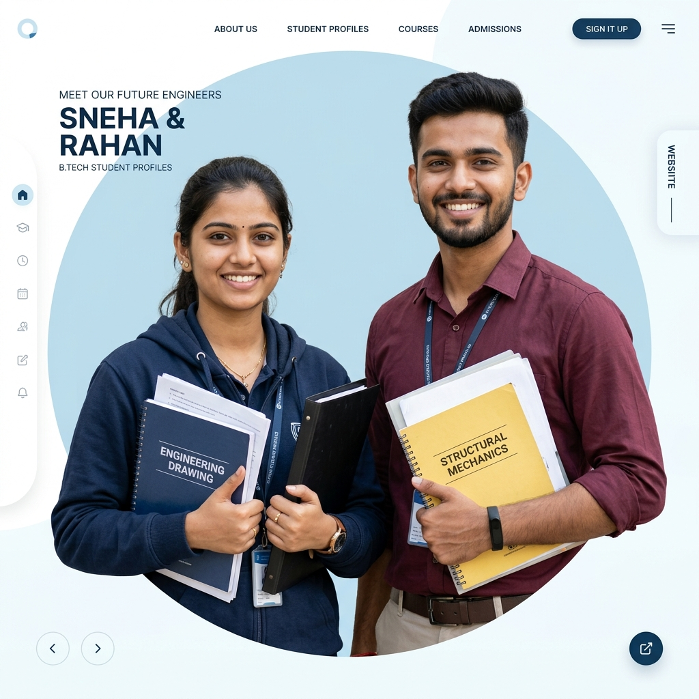

# 🎓 MSBTE Diploma Job Portal (Maharashtra Diploma Careers)

<div align="center">
  
  <p><strong>A Premium Job & Internship Platform connecting Maharashtra State Board of Technical Education (MSBTE) diploma students with top-tier industrial powerhouses.</strong></p>
</div>

---

## 🚀 Key Features

The portal is split into three high-impact management interfaces tailored to the Maharashtra industrial ecosystem:

| Portal Section | Target Audience | Features |
| :--- | :--- | :--- |
| **🎓 Student Portal** | Diploma Students (Mech, Civil, Elect, Comp/IT) | Profile building, automated resume generation/export, district-level job/internship search, click-to-apply, application tracking. |
| **🏢 Employer Portal** | Corporate Recruiters & HR | Single/bulk job postings, candidate resume filters, application review, status management (shortlist, select, reject). |
| **🛡️ Admin Portal** | MSBTE Job Board Moderators | System analytics, student/employer registries, system health metrics, platform moderation, verification controls. |

---

## 🧭 Navigation & Visual UI

- **Minimalist Accent Navbar**: Desktop header featuring a clean navigation menu with smooth color transitions and primary color bottom indicators (`border-b-2 border-primary`).
- **Responsive Mobile Drawer**: Built with a pure CSS checkbox toggle hack (`peer-checked:` combinators) requiring zero JS overhead, providing a smooth slide-out drawer on phone and tablet viewports.
- **Vibrant Hero Section**: Split-grid layout highlighting two Indian engineering students with floating hover shadow badges representing Verified Jobs, Top Companies, Easy Apply, and Local Opportunities.
- **Horizontal Stepper & Categories**: Detailed multi-step guide explaining the application workflow for both students and employers, and a grid classifying job roles by engineering branch.

---

## 🛠️ Technology Stack

- **Core**: HTML5, Vanilla JavaScript, React 18
- **Styling**: Tailwind CSS (Tailored HSL theme config with custom borders and typography weights)
- **Routing**: React Router DOM (v6)
- **Build Tool**: Vite (v5)

---

## 📁 Directory Structure

```text
├── admin portal/             # Raw HTML views for Admin Dashboard
├── employer portal/          # Raw HTML views for Employer Dashboard
├── student portal/           # Raw HTML views for Student Dashboard
├── public/                   # Static assets, mockups, and entry layouts
│   ├── students_hero.png     # Rendered engineering students graphic
│   └── home.html             # Homepage master template
├── src/                      # React source directory
│   ├── pages/                # Converted JSX components (pages)
│   │   ├── admin portal/     # Admin React pages
│   │   ├── employer portal/  # Employer React pages
│   │   ├── student portal/   # Student React pages
│   │   └── public/           # Landing, About, Contact React pages
│   ├── App.jsx               # React main Router file
│   └── main.jsx              # React mounting root
├── convert_html_to_react.js  # Automated HTML-to-React page compiler
├── tailwind.config.js        # Design tokens and custom tailwind styles
├── package.json              # Script definitions and package locks
└── README.md                 # Project documentation
```

---

## ⚙️ Development & Build Guide

### 1. Prerequisites
Ensure you have **Node.js** (v18+) and **npm** installed on your system.

### 2. Install Dependencies
Initialize the project workspace packages:
```bash
npm install
```

### 3. Running the Compiler (Crucial Step)
This project translates static HTML files from the respective portal directories directly into React JSX components. 
> [!IMPORTANT]
> **Always make modifications to the raw HTML files first** (e.g. `public/home.html` or files in `student portal/`), and then execute the compiler to generate the updated React outputs:
```bash
node convert_html_to_react.js
```
The compiler will automatically:
1. Parse raw HTML classes to JSX-compatible classes.
2. Translate relative links (like `home.html`) into React Router `Link` paths.
3. Auto-close self-closing tags (``, `<input>`).
4. Rebuild the master Router configuration inside `src/App.jsx`.

### 4. Local Development Server
Start the local Vite development server:
```bash
npm run dev
```
Open [http://localhost:5173](http://localhost:5173) in your browser.

### 5. Production Compilation
Build the production bundle for deployment:
```bash
npm run build
```
Build files will be generated under the `dist/` directory.

---

## 👤 Authors
- **Rohit Buddhe** ([@buddherohit](https://github.com/buddherohit)) - Email: rohitbudddhe564@gmail.com
- **Nema Kore** ([@nemakore](https://github.com/nemakore))
